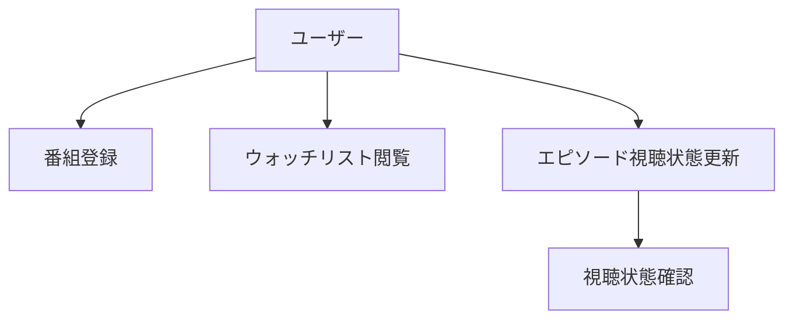
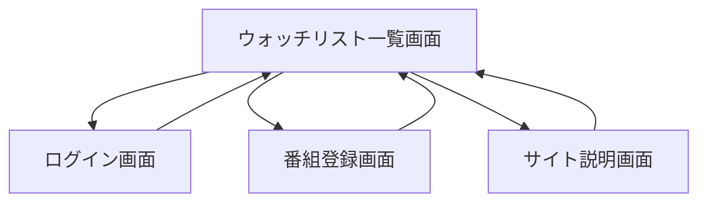

## ユースケース図

## 画面遷移図

- **ウォッチリスト一覧画面:**  
  ユーザーが登録した各番組の次 1 ヶ月分の放送スケジュールが表示されます。  
  各エピソードの放送予定や視聴済み/未視聴の状態が表示されていて、更新もできます。

- **ログイン画面:**  
  認証を行います。ログイン成功後、ホーム画面に遷移します。

- **番組登録画面:**  
  ユーザーが見逃したくない番組を新たに登録するための画面です。  
  番組名、放送周期などを入力します。
